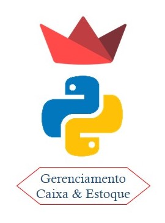

<h1 align="center">Controle de Caixa e estoque</h1>

    

### Este projeto fez parte das minhas aulas de POO (Programação Orientada a Objetos), foi desenvolvido 100% em Python utilizando Streamlit, e SQLite para o banco de dados.

 

<ul>
  <li>Tecnologias utilizadas</li>
   
</ul>

  
